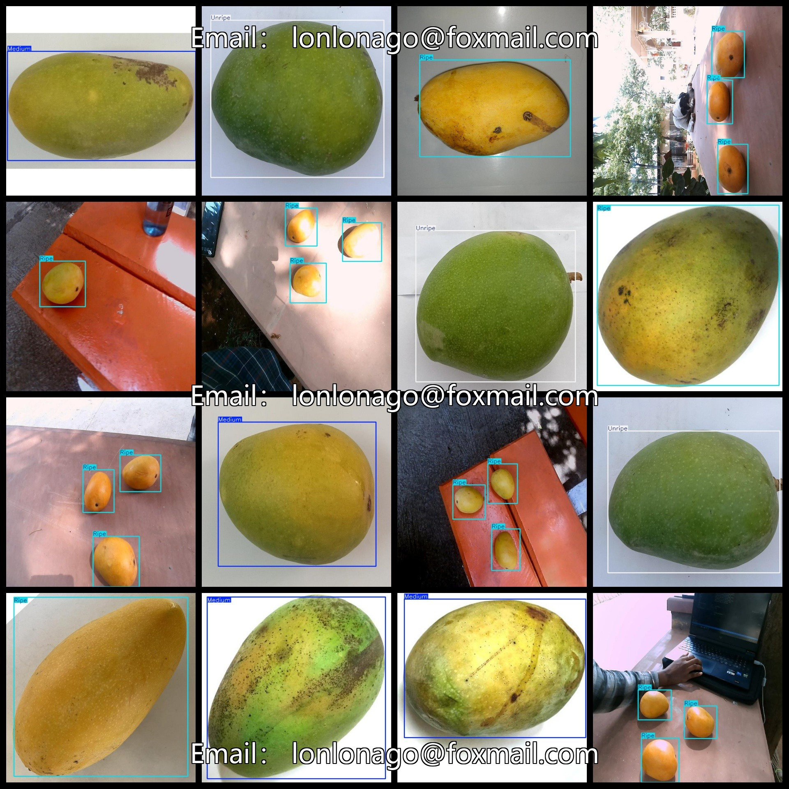
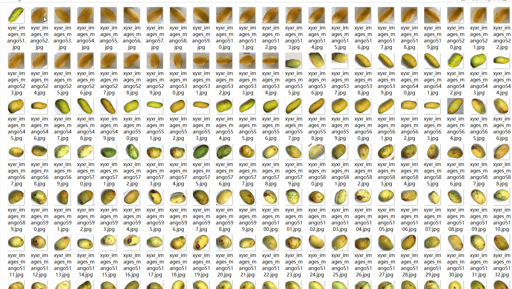

# Mango Ripeness Dataset: 2897 Images, VOC+YOLO Format

The Mango Ripeness dataset consists of 2897 images in the VOC+YOLO format. The dataset is organized into three folders: JPEGImages, Annotations, and labels. The JPEGImages folder contains a total of 2897 jpg images. The Annotations folder contains a total of 2897 xml files. The labels folder contains a total of 2897 txt files. There are a total of 3 label categories: "Medium", "Ripe", and "Unripe". Each label category has a set of boxes (in yolo format) corresponding to its respective number. Here are the box counts for each label category:

- Medium: 930 boxes
- Ripe: 1951 boxes
- Unripe: 1164 boxes

Total box count: 4045

The image resolution is clear with a resolution of pixels. The images have not been enhanced. The location of the GitHub repository is datasets_sl. The labeled images are in the form of rectangular boxes, used for target detection recognition. 

Important Note: No zero8 is mentioned here.

Special Remark: This dataset does not guarantee the accuracy or precision of the trained models or weight files. The dataset provides accurate and reasonable annotations only.

Labeling and Image Details:

## Images

---

Here is a pay link on Stripe (https://buy.stripe.com/3cs8yP7sY87d0vu9AB). Please contact me lonlonago@foxmail.com after funding $89, and I will send you a complete data files, thank you!

